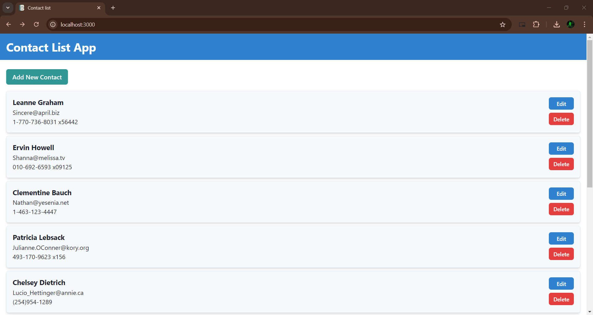
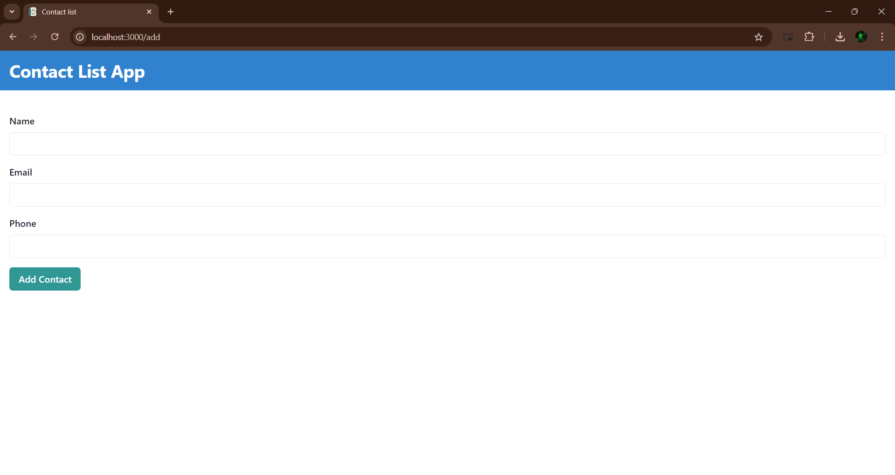
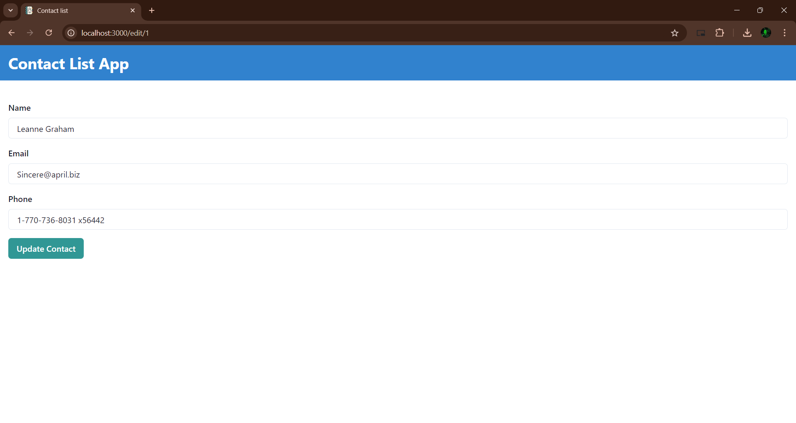

# Contact List App

<h1 align="center">Contact Manager 📇</h1> 

  A simple and efficient way to manage your contacts. 
  This app is built using <a href="https://react.dev/">React</a>, <a href="https://chakra-ui.com/">Chakra UI</a>, <a href="https://tailwindcss.com/">Tailwind CSS</a>, and <a href="https://jsonplaceholder.typicode.com/">JSONPlaceholder API</a>.

## Table of Contents

-   [Features](#features)
-   [Screenshots](#screenshots)
-   [Built With](#built-with)
-   [Setup](#setup)
-   [Author](#author)
-   [Deployed Link](#deployed-link)

## Features

-   Fetch and display contacts from an external API.
-   Add a new contact with a POST request (dummy request with no actual data stored on the server).
-   Edit an existing contact with a PUT request (dummy request with no actual data updated on the server).
-   Delete a contact with a DELETE request (dummy request with no actual data removed from the server).
-   State management using React's `useContext`, `useState`, and `useEffect` hooks for local state handling after API calls.

## Screenshots

-   **Contact List Page** 
    

-   **Add Contact Page** 
    

-   **Edit Contact Page** 
    

## Built With

-   React
-   Chakra UI
-   Tailwind CSS
-   JSONPlaceholder API

## Setup

### Frontend Setup

1. Clone the repository.
2. Navigate to the project directory: `cd contact-list-app`.
3. Install dependencies: `npm install`.
4. Start the development server: `npm start`.

### Viewing the Project

1. Open your browser and go to [http://localhost:3000/](http://localhost:3000/) to view the project.

## Author

-   [Your Name](https://github.com/yourusername)

## Deployed Link

-   [Contact Manager](https://contact-list-app-one.vercel.app/)
